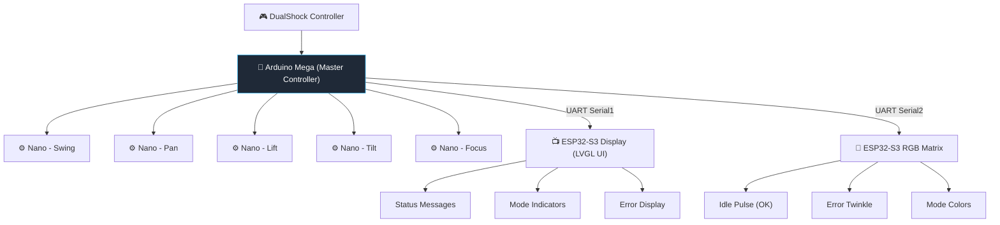
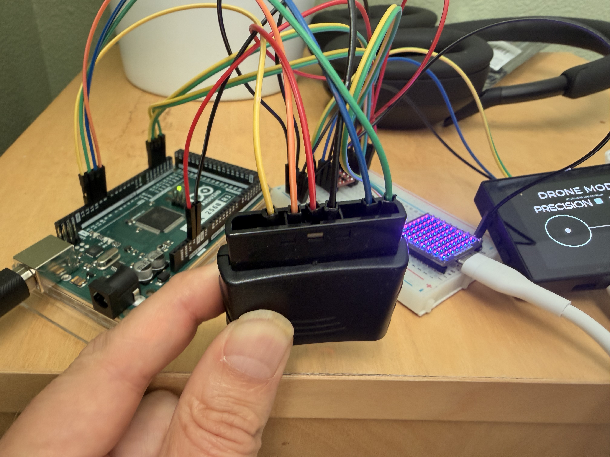
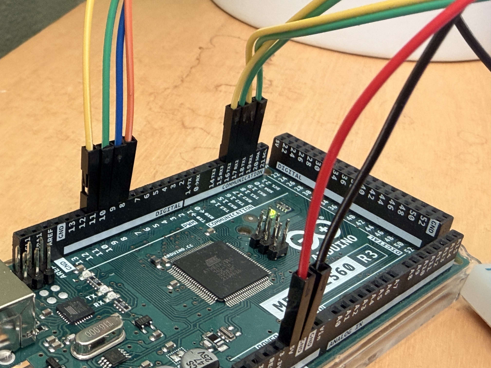

# MOCO jib

<div align="center">
	
</div>

### Open-source multi-axis motion control system for cinematic capture

A fully programmable, multi-axis motion control system for cinematic camera movement, timelapse, and automated capture workflows.

## ❤️ Why This Exists

This project started with my cousin Will Goldenberg solving a real problem:
powerful motion-control tools are often locked behind expensive, proprietary ecosystems.
Instead of buying into that model, he built his own.

- No locked software
- No forced upgrades
- No artificial limitations
- Full control over hardware and software

## 🔧 What This Project Became

The original rig proved what was possible.
From there, I stepped in to:

- Refactor the codebase for reliability and scalability
- Eliminate fragile input handling and edge-case failures
- Extend the system with real-time visual feedback and lighting systems
- Build a more cohesive, synchronized multi-device architecture

The result:

- 👉 A fully open, production-capable motion control rig
- 👉 Cinematic precision and repeatability
- 👉 Built to evolve, not depreciate

## 🎁 Our Gift to the Community

This project is our way of giving back: an open-source rig that is

- Powerful enough for real-world shooting
- Flexible enough to customize
- Accessible to anyone willing to build and learn

If you’ve wanted to:

- Build your own motion control system
- Understand how these rigs work
- Create cinematic timelapses without spending tens of thousands

This is for you.

## 🚀 What This System Does

This system combines:

- 🎮 DualShock controller input for real-time manual and drone-style control
- 🤖 Distributed motor control (Arduino Mega + 5 Nano axis controllers)
- 🧠 Advanced motion modes:
	- Timelapse
	- Bounce (MoCo)
	- Flowlapse (waypoint-based motion)
- 📡 Real-time system feedback:
	- ESP32-S3 AMOLED display (status + UI)
	- ESP32-S3 RGB matrix (controller/system state feedback)
- 🔁 UART-based architecture keeping all subsystems synchronized

Designed for smooth, repeatable cinematic motion — from manual control to fully automated multi-axis timelapse sequences.

## ✨ What Makes This Different

- 🔓 Fully Open System — no proprietary lock-in
- ⚡ No Post-Processing Required — smooth motion straight out of the rig
- 📡 Real-Time Feedback — visual UI + lighting for immediate awareness
- 🧠 Advanced Motion Intelligence — Drone Mode, Flowlapse, waypoint capture, and more
- 🛠️ Built to Last — not tied to an ecosystem that can disappear or degrade

## 🎥 Demo

<div align="center">

### 🎮 Real-Time Multi-Axis Control (Drone Mode)


*Precision-controlled multi-axis motion with real-time feedback and cinematic intent*

</div>

## 🧩 System Architecture

The rig is composed of three coordinated subsystems:

### 🎮 Control Layer (Arduino Mega)

- Processes DualShock controller input
- Manages motion modes (manual, timelapse, bounce, drone, flowlapse)
- Sends control signals to Nano motor controllers
- Broadcasts system state over UART (CONTROLLER_OK, ERROR, MODE)

### ⚙️ Motion Layer (Arduino Nano Slaves)

- One Nano per axis: swing, pan, lift, tilt, focus
- Receives speed/direction signals from Mega
- Executes motor control with speed-stage logic

### 💡 Feedback Layer (ESP32-S3)

#### 📺 Display (LVGL UI)

Listens on UART1 — **RX = GPIO 40, TX = GPIO 41, 115 200 baud**.

**System state**

| UART message | Display shown | UI element |
|---|---|---|
| `CONTROLLER_ERROR:<msg>` | Full-screen error mode; `<msg>` text shown; auto-clears after 3.5 s | Error screen |
| `CONTROLLER_OK:*` | Returns to current mode view | Mode screen |
| `EMERGENCY_STOP:ACTIVE` | "EMERGENCY\nSTOP" full-screen (latched until released) | Error screen |
| `EMERGENCY_STOP:RELEASED` | "EMERGENCY STOP\nRELEASED" overlay, then restores previous mode | Temporary overlay |

**Mode switches**

| UART message | Display shown | UI element |
|---|---|---|
| `MODE:MANUAL` | Manual mode view | Mode screen |
| `MODE:DRONE` | Drone mode view — dual stick rings, Flowlapse bar, precision/boost indicators | Mode screen |
| `MODE:TIMELAPSE` | Timelapse mode view | Mode screen |
| `MODE:BOUNCE` | Bounce mode view | Mode screen |

**Settings overlays** *(brief, then restore mode)*

| UART message | Display shown |
|---|---|
| `TIMELAPSE_INTERVAL:<sec>` | Timelapse interval value |
| `TIMELAPSE_STEPDIST:<ms>` | Timelapse step-distance value |
| `RUMBLE_MUTE:ON` | "RUMBLE\nMUTE ON" |
| `RUMBLE_MUTE:OFF` | "RUMBLE\nMUTE OFF" |

**Control feedback overlays** *(brief, then restore mode)*

| UART message | Display shown |
|---|---|
| `CONTROL:FOCUS_LEFT` / `FOCUS_RIGHT` | "FOCUS LEFT" / "FOCUS RIGHT" |
| `CONTROL:FOCUS_SPEED_DOWN` / `FOCUS_SPEED_UP` | "FOCUS SPEED DOWN" / "FOCUS SPEED UP" |
| `CONTROL:L1_PAN_SWING_UP` / `L2_PAN_SWING_DOWN` | "PAN+SWING SPEED UP" / "PAN+SWING SPEED DOWN" |
| `CONTROL:R1_LIFT_TILT_UP` / `R2_LIFT_TILT_DOWN` | "LIFT+TILT SPEED UP" / "LIFT+TILT SPEED DOWN" |
| `CONTROL:SWING_SOLO_LEFT` / `SWING_SOLO_RIGHT` | "SWING SOLO LEFT" / "SWING SOLO RIGHT" |
| `CONTROL:PAN_SOLO_LEFT` / `PAN_SOLO_RIGHT` | "PAN SOLO LEFT" / "PAN SOLO RIGHT" |
| `CONTROL:SWING_PAN_LEFT` / `SWING_PAN_RIGHT` | "SWING+PAN LEFT" / "SWING+PAN RIGHT" |
| `CONTROL:LIFT_SOLO_UP` / `LIFT_SOLO_DOWN` | "LIFT SOLO UP" / "LIFT SOLO DOWN" |
| `CONTROL:TILT_SOLO_UP` / `TILT_SOLO_DOWN` | "TILT SOLO UP" / "TILT SOLO DOWN" |
| `CONTROL:LIFT_TILT_UP` / `LIFT_TILT_DOWN` | "LIFT+TILT UP" / "LIFT+TILT DOWN" |
| `CONTROL:L3_WAYPOINT_RECORD` | Increments Flowlapse waypoint counter on drone UI |
| `CONTROL:L3_BOUNCE_ENDPOINT` | "L3\nBOUNCE\nENDPOINT SET" |

**Drone live data**

| UART message | Display shown | UI element |
|---|---|---|
| `DRONE_STICK:swing=<±100>,lift=<±100>,pan=<±100>,tilt=<±100>,lstick=<0/1>,rstick=<0/1>` | Animates stick dot positions inside the two joystick rings | Drone stick UI |
| `DRONE_MODIFIER:precision=<0/1>,boost=<0/1>` | Highlights precision and/or boost state box | Drone modifier indicators |

**Flowlapse status**

| UART message | Display shown | UI element |
|---|---|---|
| `WAYPOINT_COUNT:<n>/<total>` | Updates waypoint counter | Drone Flowlapse bar |
| `PREVIEW_WAYPOINT:<n>/<total>` | "FLOWLAPSE PREVIEW" + waypoint count | Drone Flowlapse bar |
| `progress=<n>% eta=<n>s waypoint <n>/<n>` | Progress bar fill + ETA + waypoint count | Drone Flowlapse bar |
| `recording armed` | "FLOWLAPSE READY" | Drone Flowlapse bar |
| `preview started` | "FLOWLAPSE PREVIEW" | Drone Flowlapse bar |
| `capture run started` | "FLOWLAPSE CAPTURE", progress reset to 0 | Drone Flowlapse bar |
| `capture paused` | "FLOWLAPSE PAUSED" | Drone Flowlapse bar |
| `capture resumed` | "FLOWLAPSE CAPTURE" | Drone Flowlapse bar |
| `capture complete` | Progress 100%, returns to drone mode, resets bar | Drone Flowlapse bar |
| `canceled` | Returns to drone mode, resets bar | Drone Flowlapse bar |

#### 🌈 RGB Matrix

Listens on UART1 — **RX = GPIO 44, TX = GPIO 43, 115 200 baud**.

| UART message | Matrix behavior | Color |
|---|---|---|
| `CONTROLLER_OK:*` | White pulsing breathing animation | `RGB(68–82, 68–82, 68–82)` — cool white |
| `CONTROLLER_ERROR:*` | Red base with animating pink twinkles (auto-clears after 3.5 s) | base `RGB(80, 0, 0)` · twinkle peaks `RGB(80+w, w/10, w)` — pink |
| `EMERGENCY_STOP:ACTIVE` | Red base with animating pink twinkles (latched until released) | same as error |
| `EMERGENCY_STOP:RELEASED` | Returns to previous state | — |
| `MODE:DRONE` | Solid purple (latched) | `RGB(130, 20, 170)` — `#8214AA` |
| `MODE:TIMELAPSE` | Solid amber (latched) | `RGB(170, 120, 0)` — `#AA7800` |
| `MODE:BOUNCE` | Solid teal (latched) | `RGB(0, 130, 170)` — `#0082AA` |
| `MODE:MANUAL` | Brief gray flash, then returns to OK breathing | `RGB(120, 120, 120)` — `#787878` |

All feedback devices are driven by the Mega via a lightweight UART protocol and remain synchronized with system state in real time.

Designed to be extensible — additional feedback devices can be added via the same UART protocol.

### High-Level System Diagram

The following diagram shows how controller input, motion control, and ESP32-S3 feedback layers connect.



## 🎬 What This System Can Do

	- Smooth multi-axis cinematic camera motion
	- Repeatable motion paths (bounce / MoCo)
	- Automated timelapse capture
	- Waypoint-based camera paths (Flowlapse)
	- Drone-style dual-stick control
	- Real-time feedback via display + RGB matrix
	- Controller-based configuration (no reflashing needed)

## Repository Structure

- `MEGA__master/MEGA__master.ino` — main controller logic
- `NANO_slave_1_SWING/NANO_slave_1_SWING.ino` — swing axis slave
- `NANO_slave_2_PAN/NANO_slave_2_PAN.ino` — pan axis slave
- `NANO_slave_3_LIFT/NANO_slave_3_LIFT.ino` — lift axis slave
- `NANO_slave_4_TILT/NANO_slave_4_TILT.ino` — tilt axis slave
- `NANO_slave_5_FOCUS/NANO_slave_5_FOCUS.ino` — focus axis slave
- `ESP32-S3/RIG_Display.ino` — ESP32-S3 display firmware (UART1 RX=40 TX=41 115200; `CONTROLLER_ERROR` → error screen, `MODE:*` → mode UI, `CONTROL:*` → brief overlay, `DRONE_STICK:*` → live stick animation)
- `ESP32-S3-Matrix/ESP32_S3_Matrix_Status/ESP32_S3_Matrix_Status.ino` — matrix status listener (UART1 RX=44 TX=43 115200; `CONTROLLER_ERROR` → red twinkle, `CONTROLLER_OK` → white breathing pulse, `MODE:*` → latched color)

## Notes

- Each folder contains a standalone `.ino` sketch for that board.
- Upload the corresponding sketch to each target board (Mega master or Nano slave).
- Keep serial/communication settings synchronized between master and all slaves.
- Arduino Mega/Nano onboard LEDs are single-color only (no native RGB mode indicator support).
- For color mode indicators (blue/green/red/yellow), use the optional ESP32-S3 matrix status firmware (`ESP32-S3-Matrix/ESP32_S3_Matrix_Status/ESP32_S3_Matrix_Status.ino`).

## Setup and Flashing

### Hardware required

- Arduino Mega 2560 (master)
- 5× Arduino Nano (one per axis: swing, pan, lift, tilt, focus)
- DualShock 2 (PS2) controller + receiver
- Optional: ESP32-S3 display board (2.41" AMOLED status display)
- Optional: ESP32-S3 matrix board (8×8 RGB status matrix)
- USB-A to USB-B cable (for Mega)
- USB-A to Mini-USB cables (for Nanos)

### Prerequisites

VS Code is used as the editor; builds are performed with [Arduino CLI](https://arduino.github.io/arduino-cli/), so install Arduino CLI and the AVR core first.

```sh
brew install arduino-cli          # macOS (Homebrew)
arduino-cli core update-index
arduino-cli core install arduino:avr
```

Install the `PS2X_lib` library from the vendored copy:

```sh
cp -r third_party/PS2X_lib ~/Documents/Arduino/libraries/PS2X_lib
```

### PS2 receiver wiring (Mega 2560)

Reference photos:

PS2 controller wiring:



Mega-side PS2 wiring:



Current Mega pin map from `MEGA__master/MEGA__master.ino`:

- `DAT` → Mega pin `10` (`PS2_DAT`)
- `CMD` → Mega pin `9` (`PS2_CMD`)
- `ATT` / `SEL` / `CS` → Mega pin `8` (`PS2_SEL`)
- `CLK` → Mega pin `11` (`PS2_CLK`)
- `VCC` → Mega `5V`
- `GND` → Mega `GND`

Notes:

- Receiver label names vary by board (`ATT`, `SEL`, or `CS`) but this is the same chip-select line.
- Keep a common ground between Mega and receiver.
- If your receiver has `3.3V` and `5V` options, use the level expected by your specific receiver module.

### Flashing the Mega master

1. Connect the Mega via USB.
2. Find the port:
   ```sh
   arduino-cli board list
   # Look for "Arduino Mega or Mega 2560" — port is usually /dev/cu.usbmodem* on macOS
   ```
3. Upload:
   ```sh
   arduino-cli upload -p /dev/cu.usbmodem101 --fqbn arduino:avr:mega MEGA__master
   # Replace /dev/cu.usbmodem101 with your actual port
   ```
4. Confirm boot over serial (optional):
   ```sh
   arduino-cli monitor -p /dev/cu.usbmodem101 -c baudrate=9600
	# Should print the startup speed-stage message and controller type
   ```

### Flashing a Nano slave

1. Connect the target Nano via USB.
2. Find its port with `arduino-cli board list`.
3. Upload the matching sketch (replace `NANO_slave_1_SWING` and port as needed):
   ```sh
   arduino-cli upload -p /dev/cu.usbmodem201 --fqbn arduino:avr:nano:cpu=atmega328 NANO_slave_1_SWING
   ```
4. Repeat for each axis slave (`NANO_slave_2_PAN`, `NANO_slave_3_LIFT`, `NANO_slave_4_TILT`, `NANO_slave_5_FOCUS`).

> **Note:** Some Nano clones require `cpu=atmega328old` instead of `cpu=atmega328`. If upload fails with a sync error, try the `old` variant.

### Flashing from VS Code

- The default build task (`Cmd+Shift+B`) compiles the Mega sketch.
- For upload, run the command directly in the VS Code terminal (no upload task is configured by default).

### First boot checklist

After flashing the Mega and at least one Nano slave, power up and verify:

1. Serial monitor shows the startup speed-stage message; default startup speed stage is `1` for all motion axes
2. Controller connects — Serial shows `DualShock Controller found`
3. D-pad moves the expected axis
4. L1/L2 step swing/lift speed up and down (press once per stage)
5. R1/R2 step lift/tilt speed up and down

### Mega ↔ SparkFun level shifter ↔ ESP32-S3 wiring

Use the SparkFun bi-directional logic level converter to safely connect the Arduino Mega's 5V UART pins to the ESP32-S3 boards' 3.3V UART pins.

#### SparkFun board power/reference pins

- `HV` → Mega `5V`
- `LV` → `3.3V` from one ESP32-S3 board or another stable 3.3V source
- `GND` → common ground shared by Mega, SparkFun board, and both ESP32-S3 boards

> Bench-testing note: if both ESP32-S3 boards are powered by USB from this computer, keep them USB-powered and still tie their grounds to the Mega/SparkFun ground.

#### SparkFun channel labels

The SparkFun board channels pair straight across:

- `HV1` ↔ `LV1`
- `HV2` ↔ `LV2`
- `HV3` ↔ `LV3`
- `HV4` ↔ `LV4`

Board silkscreen reference:

- Top row: `HV4`, `HV3`, `GND`, `HV`, `HV2`, `HV1`
- Bottom row: `LV4`, `LV3`, `GND`, `LV`, `LV2`, `LV1`

#### UART wiring for two ESP32-S3 boards

Recommended Mega serial assignments:

- `Serial1` (`TX1=18`, `RX1=19`) → display ESP32-S3
- `Serial2` (`TX2=16`, `RX2=17`) → RGB matrix ESP32-S3

ESP-side UART pins used by current sketches:

- Display ESP32-S3 (2.41" AMOLED): `RX=GPIO40`, `TX=GPIO41` (status UART at `115200`)
- Matrix ESP32-S3: dedicated UART header pins `RX`/`TX` are used, mapped in sketch as `RX=GPIO44`, `TX=GPIO43`

Wire the channels like this:

- `HV1` ↔ `LV1`: Mega `TX1` (pin `18`) → display ESP32-S3 `RX`
- `HV2` ↔ `LV2`: Mega `RX1` (pin `19`) ← display ESP32-S3 `TX`
- `HV3` ↔ `LV3`: Mega `TX2` (pin `16`) → RGB ESP32-S3 `RX`
- `HV4` ↔ `LV4`: Mega `RX2` (pin `17`) ← RGB ESP32-S3 `TX`

Current bench wiring (as wired):

- Mega `TX1` (yellow) is on `HV1`
- Mega `RX1` is on `HV2`
- Mega `TX2` is on `HV3`
- Mega `RX2` is on `HV4`

Matching low-voltage side should be:

- `LV1` → display ESP `GPIO40` (`RX`)
- `LV2` ← display ESP `GPIO41` (`TX`)
- `LV3` → matrix ESP `RX` header pin (`GPIO44`)
- `LV4` ← matrix ESP `TX` header pin (`GPIO43`)

If you use the recommended matrix test pair above, the practical map is:

- `HV3` ↔ `LV3`: Mega `TX2` (pin `16`) → matrix ESP32-S3 `GPIO44` (`RX`)
- `HV4` ↔ `LV4`: Mega `RX2` (pin `17`) ← matrix ESP32-S3 `GPIO43` (`TX`)

UART rule reminder: `TX` always goes to the other board's `RX`, and `RX` goes to the other board's `TX`.

#### Wiring checklist

- Use a small breadboard so the SparkFun board sits cleanly with one pin per row
- Do **not** connect Mega UART pins directly to ESP32-S3 RX pins without the level shifter
- Do **not** tie the `3.3V` outputs of both ESP32-S3 boards together; use only one `3.3V` source for the SparkFun `LV` reference
- Do **not** power ESP32-S3 boards from the Mega `3.3V` pin on the final rig; use a dedicated 3.3V regulator or the ESPs' own regulated supply
- Always share ground between Mega, SparkFun board, and both ESP32-S3 boards

### Waveshare ESP32-S3 Matrix status test

Use `ESP32-S3-Matrix/ESP32_S3_Matrix_Status/ESP32_S3_Matrix_Status.ino` to drive the onboard 8×8 matrix from Mega status messages.

#### Flashing the matrix ESP32-S3

1. Connect the matrix ESP32-S3 board via USB.
2. Find its port:
   ```sh
   arduino-cli board list
   # Look for "ESP32-S3" — port is usually /dev/cu.usbmodem* on macOS
   ```
3. Compile and upload:
   ```sh
   arduino-cli compile --fqbn esp32:esp32:esp32s3 ESP32-S3-Matrix/ESP32_S3_Matrix_Status && \
   arduino-cli upload -p /dev/cu.usbmodem11101 --fqbn esp32:esp32:esp32s3 ESP32-S3-Matrix/ESP32_S3_Matrix_Status
   # Replace /dev/cu.usbmodem11101 with your actual port
   ```

#### Matrix behavior

- UART mapping in sketch defaults to `RX=GPIO40`, `TX=GPIO41`, `9600 baud`
- `CONTROLLER_ERROR:*` sets the matrix to red with animating pink twinkles
- `CONTROLLER_OK:*` displays white pulsing breathing animation

Recommended Mega serial path for matrix:

- Mega `TX2` (pin `16`) → level shifter `HV3` ↔ `LV3` → matrix ESP `GPIO40` (`RX`)
- Mega `RX2` (pin `17`) ← level shifter `HV4` ↔ `LV4` ← matrix ESP `GPIO41` (`TX`)

If your matrix board routes the LED data line to a different GPIO, update `MATRIX_DATA_PIN` in the sketch before flashing.

## Dependencies

- Required Arduino library: `PS2X_lib` (for `#include <PS2X_lib.h>` in the Mega sketch)
- Source: https://github.com/madsci1016/Arduino-PS2X.git
- Vendored copy in this repo: `third_party/PS2X_lib/`
- Install location (macOS): `~/Documents/Arduino/libraries/PS2X_lib/`
- Expected header path after install: `~/Documents/Arduino/libraries/PS2X_lib/PS2X_lib.h`
- Restart Arduino IDE after installing so the library index refreshes
- The vendored copy is kept in-repo for traceability, but Arduino IDE may still prefer the sketchbook-installed library unless your build tooling is configured to use the repo copy directly

### Build with Arduino CLI

This project has been verified to build from the terminal/VS Code using:

- `arduino-cli compile --fqbn arduino:avr:mega "/Users/micahbreitenstein/Downloads/to Micah/MEGA__master"`

This targets the Arduino Mega 2560 (`arduino:avr:mega`) and compiles the master sketch without needing to open Arduino IDE.

### Build with VS Code

- Install an Arduino extension in VS Code (workspace recommendations are in `.vscode/extensions.json`)
- Use the default build task in `.vscode/tasks.json`
- Run build with `Cmd+Shift+B` and choose `Arduino CLI: Build Mega master` (or let it run as the default build task)
- The task uses the same verified command above (`arduino-cli compile --fqbn arduino:avr:mega ...`)

## Controller Buttons (DualShock)

| Button | Function | Display | Matrix |
|---|---|---|---|
| D-pad left/right | Swing axis (solo, no pan) | X |  |
| D-pad left/right + SELECT held | Pan axis only (solo mode) | X |  |
| D-pad left/right (no SELECT) | Swing + pan combined | X |  |
| D-pad up/down | Lift axis (solo, no tilt) | X |  |
| D-pad up/down + SELECT held | (reserved for solo lift — see solo mode logic) | X |  |
| D-pad up/down (no SELECT) | Lift + tilt combined | X |  |
| Right stick X | Pan trim (during swing) or pan-only at extremes (left stick = pan left, right stick = pan right) | X |  |
| Right stick Y | Tilt trim (during lift) or tilt-only at extremes (stick up = tilt up, stick down = tilt down) | X |  |
| Triangle / Cross | Focus left / right | X |  |
| Square / Circle | Focus speed down / up | X |  |
| L1 / L2 | Pan + swing speed up / down | X |  |
| R1 / R2 | Lift + tilt speed up / down | X |  |
| **L1 + L2 + R1 + R2** | **Emergency stop: immediately stops all motors, cancels timelapse/bounce, and clears interval rumble. Normal controls resume after release.** | X | X |
| **START + SELECT + SQUARE** | **Toggle controller rumble mute/unmute. Serial logs stay enabled.** | X |  |
| **START + D-pad UP / DOWN** | **Adjust timelapse interval by ±1 second per press (only when auto modes are idle).** | X |  |
| **START + D-pad RIGHT / LEFT** | **Adjust timelapse move time (`stepDist`) by ±10 ms per press (only when auto modes are idle).** | X |  |
| SELECT release | Start timelapse mode (stick position selects mode 1–8) | X | X |
| START release | Start bounce/moco mode (stick position selects mode 1–8) | X | X |
| L3 (left stick click) | **Normal mode:** set bounce distance endpoint (ends stage 0, starts stage 1); double medium pulse confirms lock. **Drone Mode:** record current axis positions as a Flowlapse waypoint; short rumble confirms. | X |  |
| **R3 (press right joystick inward / right stick click)** | **Toggle Drone Mode ON/OFF. Enter = single medium pulse; Exit = double medium pulse. While Drone Mode is active, timelapse and bounce are locked out, and both joysticks control motion at multiple speed levels based on stick deflection.** | X | X |

### Timelapse Modes (SELECT release)

Stick position at moment of SELECT release selects the move:

| Stick position | Mode |
|---|---|
| Left + down | 1: swing left, boom down |
| Left + up | 2: swing left, boom up |
| Right + up | 3: swing right, boom up |
| Right + down | 4: swing right, boom down |
| Full left (X=0) | 5: swing left only |
| Full up (Y=0) | 6: boom up only |
| Full right (X=255) | 7: swing right only |
| Full down (Y=255) | 8: boom down only |

- **Stop/reset:** hold **L1 + L2 + R1 + R2** for emergency stop

### Bounce / MoCo Modes (START release)

Same stick positions as timelapse modes above, triggered with START instead of SELECT.
- **Stage 0:** rig moves in the initial direction; press L3 to mark the travel distance — a double medium pulse confirms the endpoint is locked
- **Stage 1:** rig bounces back and forth over the recorded distance automatically
- **Stop/reset:** hold **L1 + L2 + R1 + R2** for emergency stop
- **Minimum endpoint duration:** L3 endpoint capture requires at least `150 ms` of stage-0 travel; shorter taps are rejected with deny rumble + Serial warning

## New Features

### Emergency stop combo

Use this at any time for a hard stop:

- Hold **L1 + L2 + R1 + R2** together
- This immediately:
	- stops all motor outputs
	- cancels active timelapse mode (if running)
	- cancels active bounce mode (if running)
	- clears interval rumble feedback
- Recovery behavior:
	- while all 4 buttons are held, other inputs are ignored
	- after releasing the combo, manual controls respond again immediately
	- on combo release, Serial prints `EMERGENCY STOP RELEASED | controls re-enabled`
	- on combo release, a short confirmation rumble plays to confirm controls are re-enabled
	- timelapse/bounce stay canceled until you start them again (SELECT release / START release)

### Rumble mute toggle

Use this when you want quiet operation but still want Serial feedback:

- Hold **START + SELECT + SQUARE** together to toggle rumble mute
- When muted:
	- controller vibration output is disabled
	- Serial log messages still print normally
	- interval / `stepDist` / limit / deny / drone-mode / release rumble patterns are suppressed on the controller
- When unmuted:
	- controller rumble output resumes normally
	- a short confirmation rumble plays when rumble is turned back on

### Drone mode (R3 toggle)

Use this for dual-stick flying-drone style control.

- Press **R3** to toggle Drone Mode ON/OFF
- Enter feedback: **1 medium pulse**
- Exit feedback: **2 medium pulses**
- Enter behavior: active timelapse/bounce are reset and locked out while Drone Mode is active
- Both left and right sticks support multiple speed levels based on stick deflection (low / medium / high)
- Left stick in Drone Mode:
	- X controls swing direction + proportional speed
	- Y controls lift direction + proportional speed
- Right stick in Drone Mode:
	- X controls pan direction + proportional speed
	- Y controls tilt direction + proportional speed
- Focus stays on Triangle/Cross with Square/Circle speed control
- In Drone Mode, **SELECT/START are remapped to Flowlapse controls** (timelapse/bounce mode selection is ignored while Drone Mode is active)
- Drone speed modifiers while in Drone Mode:
	- Hold `L2` for **micro-motion mode**: ultra-smooth cinematic movement at 0.25x speed (macro shots, interview push-ins, product framing)
	- Hold `R2` for temporary boost mode (one speed tier faster, never above per-axis cap)
	- If both `L2` and `R2` are held together, L2 takes priority (micro-motion)
- Exit Drone Mode by pressing **R3** again (toggle off)

### Flowlapse pause/resume (Drone Mode only)

Control capture timing when environmental factors change (wind, subject position, lighting).

- **Press START during active Flowlapse capture** → **PAUSE**: motors stop immediately, capture timer halts, you can adjust conditions
- **Press START again** → **RESUME**: rig picks up exactly where it paused, no loss of already-captured frames
- Useful when:
	- Wind direction/speed changes and you need to wait for conditions to stabilize
	- Subject repositions or enters/exits framing
	- Lighting changes (clouds, golden hour shift) and you want to wait for better light
	- An unexpected interruption occurs but you're still committed to the shot
	- You need to make a manual micro-adjustment to the rig position mid-capture
- Safety:
	- Combines with existing Flowlapse controls naturally (no new button conflicts)
	- Can't accidentally clear or undo while paused (combo operations blocked)
	- Resume picks up with the same motion tier and dwell settings

### Per-waypoint dwell time (Drone Mode only)

Set a different dwell for each waypoint instead of one global dwell for the whole run.

- Global default dwell is still adjusted with **SELECT + D-pad UP/DOWN** while recording
- In ready states (**READY_FOR_PREVIEW** / **READY_FOR_CAPTURE**), jog to a waypoint with **D-pad LEFT/RIGHT**
- Then use **TRIANGLE + D-pad UP/DOWN** to adjust dwell for the selected waypoint only
- Serial prints explicit selected waypoint dwell values while jogging and editing
- Great for:
	- Product reveal holds at key angles
	- Interview pauses on specific composition points
	- Rack-focus timing pauses at only selected points
	- Mixed pacing in one run (example: WP1=5s, WP2=0s, WP3=10s)

### Loop mode (Drone Mode only)

Enable continuous ping-pong motion for ambient or interview-style movement.

- Toggle with **START + SELECT + CIRCLE**
- When enabled, Flowlapse capture follows: **1 -> 2 -> 3 -> ... -> N -> ... -> 3 -> 2 -> 1 -> repeat**
- Works for normal waypoint capture mode (disabled automatically in frame-count mode)
- Useful for:
	- Interviews (continuous subtle movement without restarting runs)
	- Ambient motion shots
	- YouTube filming where repeatable back-and-forth motion is desirable

### Acceleration curve selection (Drone Mode only)

Choose how each Flowlapse move segment accelerates/decelerates at runtime.

- In **READY_FOR_PREVIEW** or **READY_FOR_CAPTURE**, tap **TRIANGLE** to cycle acceleration profile
- Profiles cycle in this order:
	- `linear`
	- `ease in/out`
	- `cinematic slow start`
	- `robotic constant`
- Serial logs the active profile name; rumble pulse count (`1..4`) also indicates selected profile index
- Useful for:
	- Matching movement feel to shot intent without reflashing
	- Soft cinematic starts for reveal shots
	- Constant/mechanical pacing for product-style robotic moves

### Flowlapse (Drone Mode only)

Flowlapse is a waypoint timelapse system for recording a multi-axis camera path and replaying it as a timelapse. It runs using the four Drone Mode axes (swing/lift/pan/tilt).

- Waypoint recording (up to 8 points):
	- Press **L3** to record the current location estimate as a waypoint
	- Each waypoint record gives a short rumble confirmation; axis positions (swing/lift/pan/tilt) print to serial
	- Waypoints are **session-only** (cleared on power cycle / drone mode restart)
- Control flow:
	- **1st SELECT**: stop waypoint recording (requires at least 2 waypoints); controller rumbles once per recorded waypoint as a count confirmation
	- **2nd SELECT**: run preview pass through recorded waypoints for visual check
	- **START while preview is running**: force-complete preview and move to **READY_FOR_CAPTURE** (useful if preview appears stuck)
	- **START during capture**: pause capture; motors stop, timer halts. Press START again to resume
	- **START + SELECT + CIRCLE**: toggle ping-pong loop mode (1→2→…→N→…→2→1→repeat)
	- **START + SELECT + TRIANGLE**: toggle frame-count mode at runtime (no recompile needed); this changes whether preview/capture use equal-distance frame stops or normal waypoint stepping
	- **TRIANGLE** in ready states: cycle acceleration profile (`linear` / `ease in/out` / `cinematic slow start` / `robotic constant`)
	- While in ready states (after recording stop and after preview), tap **D-pad RIGHT/LEFT** to jog one waypoint forward/backward (`current/total` waypoint index prints to Serial)
	- **SELECT + D-pad UP/DOWN** adjusts the **global default dwell** used for newly recorded waypoints (250 ms steps, 0 to 5000 ms)
	- **TRIANGLE + D-pad UP/DOWN** adjusts dwell for the **currently selected waypoint** in ready states
	- Dwell adjustment rumble encodes dwell in 250 ms steps (e.g., `1000 ms` = 4 pulses); `0 ms` plays a double pulse (disabled)
	- **START**: run actual Flowlapse capture when in **READY_FOR_CAPTURE** (if you skipped preview with START, press START again to begin capture)
	- **L1 + R1**: wipe the full Flowlapse course and re-arm recording
	- **L2 + R2 (1st press)**: move the rig back to the **last** recorded waypoint
	- **L2 + R2 (2nd press)**: rumble + delete that last point (repeat this two-step cycle to walk the path backward)
	- **START + R1**: return to the first waypoint (jog from current position back to waypoint 1); only active when not already running preview/capture/undo/jog
	- **L2 hold during preview**: speed up preview playback to 3x normal speed for quick testing and path verification (release L2 to resume normal speed)
- Capture pause/resume (useful if wind changes, subject moves, or lighting shifts):
	- Press **START** during active capture to **pause**: motors stop immediately, capture timer halts
	- Press **START** again to **resume** from the paused position (no loss of already-captured frames)
	- Hold **L3** for `FLOWLAPSE_L3_RESET_HOLD_MS` to quick-reset: clear course + re-arm recording
- Capture behavior:
	- Trigger/pause uses `timelapseIntervalSeconds` (same camera interval timing model)
	- Move slice uses `stepDist` (same move-duration concept as normal timelapse)
	- Segment motion uses smooth ease-in/ease-out timing (slow start/end, faster mid-segment) when `FLOWLAPSE_EASE_IN_OUT_ENABLED = true`
	- `FLOWLAPSE_EASE_STRENGTH` blends easing intensity (`0.0` ≈ linear, `1.0` = strong easing)
	- With `FLOWLAPSE_ARC_LENGTH_SAMPLING_ENABLED = true`, curved capture uses arc-length-based sampling for more path-even spatial progression
	- With `FLOWLAPSE_FRAME_COUNT_MODE_ENABLED = true`, capture places stops at equal path distances and takes exactly `FLOWLAPSE_FRAME_COUNT_TARGET` photos (including first and last stop)
	- The compile-time `FLOWLAPSE_FRAME_COUNT_MODE_ENABLED` value is now just the boot default; you can toggle the live mode from the controller with **START + SELECT + TRIANGLE**
	- Preview also follows the actual evenly spaced frame-count stops when frame-count mode is enabled, rather than only previewing recorded waypoints
	- On capture start in frame-count mode, Serial logs the computed plan, e.g. `Frame-count: 48 frames | spacing=12.4 units`
	- Frame-count completion feedback: Serial prints `Frame-count capture complete (N frames) — mode exited` and plays a distinct long+short rumble pulse
	- While frame-count mode is active, loop modes are explicitly disabled for the run (`FLOWLAPSE_LOOP_CAPTURE` and `FLOWLAPSE_PING_PONG_LOOP` are ignored with Serial notice)
	- Motion is interpolated per-axis between recorded waypoints over repeated frame cycles
	- With `FLOWLAPSE_CURVED_PATH_ENABLED = true`, capture move phase follows a smooth Catmull-Rom curved path through waypoints (fallback to linear path when fewer than 3 waypoints)
	- Optional dwell/settle pause before each trigger uses the destination waypoint's dwell (`waypoint.dwellMs`), defaulting from `flowlapseDwellMs` when waypoint is recorded
	- Serial capture progress logs include an estimated remaining time (`eta=Ns`)
	- Set `FLOWLAPSE_LOOP_CAPTURE = true` to auto-restart capture from waypoint 0 after each full pass (default `false`)
	- Set `FLOWLAPSE_PING_PONG_LOOP = true` to continuously reverse direction at path ends (forward/backward loop)
	- Set `FLOWLAPSE_RETURN_TO_FIRST_WAYPOINT_ON_COMPLETE = true` to auto-return to waypoint 1 after non-loop capture completes
- While waiting in READY_FOR_PREVIEW or READY_FOR_CAPTURE, focus axis (Triangle/Cross/Square/Circle) stays fully responsive
- Safety behavior:
	- Playback speed is capped conservatively (no aggressive instant max-speed jumps)
	- Speed tiers ramp gradually, including direction reversals (e.g., opposite endpoints)
	- Emergency stop (**L1 + L2 + R1 + R2**) immediately cancels Flowlapse motion

#### Drone mode reference

Use this quick map while flying manually (assuming DIP reverse switches are OFF):

| Control | Result |
|---|---|
| Left stick LEFT | Swing left |
| Left stick RIGHT | Swing right |
| Left stick UP | Lift up |
| Left stick DOWN | Lift down |
| Right stick LEFT | Pan left |
| Right stick RIGHT | Pan right |
| Right stick UP | Tilt up |
| Right stick DOWN | Tilt down |
| Triangle | Focus one direction |
| Cross | Focus opposite direction |
| Square | Focus speed down |
| Circle | Focus speed up |
| Hold L2 | Precision modifier (slower/finer control) |
| Hold R2 | Boost modifier (faster response) |

Speed level is based on how far you push either stick from center (small deflection = slower, large deflection = faster).

#### Drone mode tuning constants (firmware)

These constants live in [MEGA__master/MEGA__master.ino](MEGA__master/MEGA__master.ino) and control Drone Mode feel:

- Per-axis expo curves:
	- `DRONE_SWING_EXPO_PERCENT` (currently `65`)
	- `DRONE_LIFT_EXPO_PERCENT` (currently `65`)
	- `DRONE_PAN_EXPO_PERCENT` (currently `65`)
	- `DRONE_TILT_EXPO_PERCENT` (currently `65`)
	- Higher = softer response near center, more ramp near edge
	- Lower = more linear response
- Per-axis deadbands:
	- `DRONE_SWING_DEADBAND` (currently `12`)
	- `DRONE_LIFT_DEADBAND` (currently `14`)
	- `DRONE_PAN_DEADBAND` (currently `10`)
	- `DRONE_TILT_DEADBAND` (currently `10`)
	- Inside deadband, both direction and speed are forced to stop for that axis
- Per-axis max speed caps:
	- `DRONE_SWING_MAX_SPEED_TIER` (currently `DRONE_SPEED_TIER_MED`)
	- `DRONE_LIFT_MAX_SPEED_TIER` (currently `DRONE_SPEED_TIER_MED`)
	- `DRONE_PAN_MAX_SPEED_TIER` (currently `DRONE_SPEED_TIER_HIGH`)
	- `DRONE_TILT_MAX_SPEED_TIER` (currently `DRONE_SPEED_TIER_MED`)
	- Available tiers: `DRONE_SPEED_TIER_STOP`, `DRONE_SPEED_TIER_MED`, `DRONE_SPEED_TIER_HIGH`
- Speed tier thresholds (expo-space):
	- `DRONE_SPEED_TIER_MED_THRESHOLD` (currently `43`)
	- `DRONE_SPEED_TIER_HIGH_THRESHOLD` (currently `86`)
- Modifier toggles:
	- `DRONE_ENABLE_PRECISION_MODIFIER` (currently `true`)
	- `DRONE_ENABLE_BOOST_MODIFIER` (currently `true`)
	- `DRONE_L2_R2_NEUTRAL_MODE` (currently `true`)
- Logging:
	- `DRONE_IDLE_TIMEOUT_MS` (disabled; idle auto-exit removed)
	- `DRONE_SERIAL_LOG_ENABLED` (currently `true`) — set `false` to silence runtime drone logs (axis movement and modifier state). Boot tuning profile always prints regardless.
	- `DRONE_MICRO_MOTION_SPEED_RATIO` (currently `0.25`) — L2 micro-motion multiplier for ultra-smooth cinematic control
- Flowlapse safety constants:
	- `FLOWLAPSE_MAX_WAYPOINTS` (currently `8`)
	- `FLOWLAPSE_LOOP_CAPTURE` (currently `false`) — set `true` to loop capture continuously from start after each pass
	- `FLOWLAPSE_WAYPOINT_RUMBLE_ON_MS` (currently `90`) — waypoint-confirm rumble on-time
	- `FLOWLAPSE_WAYPOINT_RUMBLE_TOTAL_MS` (currently `180`) — waypoint-confirm rumble total pulse window
	- `FLOWLAPSE_WAYPOINT_RUMBLE_PULSES` (currently `1`) — waypoint-confirm pulse count
	- `FLOWLAPSE_PREVIEW_POINT_HOLD_MS` (currently `700`) — hold duration at each preview waypoint
	- `FLOWLAPSE_MAX_SPEED_TIER` (currently `DRONE_SPEED_TIER_MED`)
	- `FLOWLAPSE_TIER_RAMP_INTERVAL_MS` (currently `450`)
	- `FLOWLAPSE_AXIS_STOP_TOLERANCE` (currently `1.0`) — target-reached tolerance band
	- `FLOWLAPSE_AXIS_MED_ERROR` / `FLOWLAPSE_AXIS_HIGH_ERROR` (currently `4.0` / `12.0`) — error bands for tier selection
	- `FLOWLAPSE_MIN_WAYPOINT_SEPARATION` (currently `2.5`) — minimum spacing between recorded waypoints
	- `FLOWLAPSE_MANUAL_TRACK_RATE_UNITS_PER_SEC` / `FLOWLAPSE_MED_RATE_UNITS_PER_SEC` / `FLOWLAPSE_HIGH_RATE_UNITS_PER_SEC` (currently `14` / `10` / `18`) — open-loop motion model rates
	- `FLOWLAPSE_CAPTURE_PROGRESS_LOG_MS` (currently `2000`) — progress/ETA serial print cadence
	- `FLOWLAPSE_CURVED_PATH_ENABLED` (currently `true`) — enables smooth curved interpolation during capture move phase
	- `FLOWLAPSE_WAYPOINT_DWELL_MS` (currently `0`) — boot default dwell in ms before each trigger
	- `FLOWLAPSE_DWELL_ADJUST_INCREMENT_MS` (currently `250`) — controller dwell step size
	- `FLOWLAPSE_DWELL_MAX_MS` (currently `5000`) — controller dwell upper cap
	- `FLOWLAPSE_PREVIEW_SPEED_SCALE` (currently `0.70`) — preview-only motion speed multiplier
	- `FLOWLAPSE_L3_RESET_HOLD_MS` (currently `1500`) — L3 hold duration for quick reset/re-arm
	- `FLOWLAPSE_EASE_IN_OUT_ENABLED` (currently `true`) — applies smooth ease-in/ease-out timing to each capture segment
	- `FLOWLAPSE_EASE_STRENGTH` (currently `1.0`) — easing blend (`0.0` linear to `1.0` strong easing)
	- `FLOWLAPSE_PING_PONG_LOOP` (currently `false`) — reverses direction automatically at each path edge
	- `FLOWLAPSE_RETURN_TO_FIRST_WAYPOINT_ON_COMPLETE` (currently `false`) — auto-return to waypoint 1 after a non-loop run
	- `FLOWLAPSE_ARC_LENGTH_SAMPLING_ENABLED` (currently `true`) — enables arc-length reparameterization in curved capture segments
	- `FLOWLAPSE_ARC_LENGTH_QUALITY_PRESET` (currently `FLOWLAPSE_ARC_LENGTH_QUALITY_MED`) — simple quality selector (`LOW`, `MED`, `HIGH`)
	- `FLOWLAPSE_ARC_LENGTH_TABLE_STEPS` (currently `16`) — auto-derived from preset (`LOW=8`, `MED=16`, `HIGH=24`)
	- Preset intent: **Low = faster/lighter**, **Med = balanced**, **High = smoothest/heaviest**
	- `FLOWLAPSE_FRAME_COUNT_MODE_ENABLED` (currently `false`) — when enabled, capture progression uses equal-distance frame stops
	- `FLOWLAPSE_FRAME_COUNT_TARGET` (currently `48`) — total number of capture stops/frames in frame-count mode
	- `FLOWLAPSE_FRAMECOUNT_AUTO_EXIT` (currently `true`) — exits frame-count mode after completion (set `false` to remain armed for rerun)

Quick tuning guide:

- If an axis drifts at center, increase that axis deadband by `1-2`
- If stick response feels too twitchy near center, increase that axis `DRONE_*_EXPO_PERCENT`
- If controls feel sluggish, decrease that axis `DRONE_*_EXPO_PERCENT` or reduce deadband on that axis
- If an axis is too aggressive at full stick, lower that axis `DRONE_*_MAX_SPEED_TIER`
- On boot, Serial prints expo/deadband/max-tier/modifier/threshold/idle-timeout/log-flag summaries so you can confirm the active profile
- On boot, Serial prints a compact Flowlapse mode summary line, e.g. `Flowlapse summary | ease=Y strength=1.00 loop=N frame=N fexit=Y arc=Y ping-pong=N return-home=N`
	- Field mapping: `ease` → `FLOWLAPSE_EASE_IN_OUT_ENABLED`, `strength` → `FLOWLAPSE_EASE_STRENGTH`, `loop` → `FLOWLAPSE_LOOP_CAPTURE`, `frame` → `FLOWLAPSE_FRAME_COUNT_MODE_ENABLED`, `fexit` → `FLOWLAPSE_FRAMECOUNT_AUTO_EXIT`, `arc` → `FLOWLAPSE_ARC_LENGTH_SAMPLING_ENABLED`, `ping-pong` → `FLOWLAPSE_PING_PONG_LOOP`, `return-home` → `FLOWLAPSE_RETURN_TO_FIRST_WAYPOINT_ON_COMPLETE`
- On boot, Serial also prints DIP axis reversal state for all 5 axes: `Boot axis reversal | swing=N pan=N lift=N tilt=N focus=N` (`Y` = reversed, `N` = normal)
- When `DRONE_SERIAL_LOG_ENABLED = true`, the Mega prints edge-triggered events: per-axis start/stop movement and L2/R2 modifier state changes

#### Starter profiles (copy these values)

Pick one profile and set the constants in [MEGA__master/MEGA__master.ino](MEGA__master/MEGA__master.ino):

- **Safe / Indoor (slow + smooth):**
	- `DRONE_SWING_EXPO_PERCENT = 75`
	- `DRONE_LIFT_EXPO_PERCENT = 75`
	- `DRONE_PAN_EXPO_PERCENT = 75`
	- `DRONE_TILT_EXPO_PERCENT = 75`
	- `DRONE_SWING_DEADBAND = 14`
	- `DRONE_LIFT_DEADBAND = 16`
	- `DRONE_PAN_DEADBAND = 12`
	- `DRONE_TILT_DEADBAND = 12`
	- `DRONE_SWING_MAX_SPEED_TIER = DRONE_SPEED_TIER_MED`
	- `DRONE_LIFT_MAX_SPEED_TIER = DRONE_SPEED_TIER_MED`
	- `DRONE_PAN_MAX_SPEED_TIER = DRONE_SPEED_TIER_MED`
	- `DRONE_TILT_MAX_SPEED_TIER = DRONE_SPEED_TIER_MED`

- **Balanced (default feel):**
	- `DRONE_SWING_EXPO_PERCENT = 65`
	- `DRONE_LIFT_EXPO_PERCENT = 65`
	- `DRONE_PAN_EXPO_PERCENT = 65`
	- `DRONE_TILT_EXPO_PERCENT = 65`
	- `DRONE_SWING_DEADBAND = 12`
	- `DRONE_LIFT_DEADBAND = 14`
	- `DRONE_PAN_DEADBAND = 10`
	- `DRONE_TILT_DEADBAND = 10`
	- `DRONE_SWING_MAX_SPEED_TIER = DRONE_SPEED_TIER_MED`
	- `DRONE_LIFT_MAX_SPEED_TIER = DRONE_SPEED_TIER_MED`
	- `DRONE_PAN_MAX_SPEED_TIER = DRONE_SPEED_TIER_HIGH`
	- `DRONE_TILT_MAX_SPEED_TIER = DRONE_SPEED_TIER_MED`

- **Fast / Outdoor (more aggressive):**
	- `DRONE_SWING_EXPO_PERCENT = 50`
	- `DRONE_LIFT_EXPO_PERCENT = 50`
	- `DRONE_PAN_EXPO_PERCENT = 50`
	- `DRONE_TILT_EXPO_PERCENT = 50`
	- `DRONE_SWING_DEADBAND = 10`
	- `DRONE_LIFT_DEADBAND = 12`
	- `DRONE_PAN_DEADBAND = 8`
	- `DRONE_TILT_DEADBAND = 8`
	- `DRONE_SWING_MAX_SPEED_TIER = DRONE_SPEED_TIER_HIGH`
	- `DRONE_LIFT_MAX_SPEED_TIER = DRONE_SPEED_TIER_MED`
	- `DRONE_PAN_MAX_SPEED_TIER = DRONE_SPEED_TIER_HIGH`
	- `DRONE_TILT_MAX_SPEED_TIER = DRONE_SPEED_TIER_HIGH`

### Controller-adjustable timelapse interval (no reflash needed)

You can now change the timelapse interval directly from the controller while no auto mode is active.

- **Increase interval:** hold **START** and tap **D-pad UP**
- **Decrease interval:** hold **START** and tap **D-pad DOWN**
- **Allowed range:** 1 to 99 seconds
- **Safety rule:** this adjustment is only active when both timelapse and bounce are idle
- **Persistence:** saved on change and restored at boot
- **Limit feedback:** trying to go below/above range gives a distinct double-short rumble
- **Lockout feedback:** trying this combo while timelapse or bounce is active gives a distinct triple-short deny rumble
- **R3 behavior:** toggles Drone Mode ON/OFF (does not cancel timelapse/bounce directly)

When changed, the Mega prints the value over Serial as:

- `Timelapse interval (seconds) = X`

### Rumble interval feedback (time-code)

After each interval change, the controller rumbles in a pattern that encodes the selected seconds:

- **Long rumble = 10 seconds**
- **Short rumble sequence = 1-second units**

Examples:

- **15 seconds** → 1 long + 5 short
- **20 seconds** → 2 long
- **24 seconds** → 2 long + 4 short

Interpretation guide:

- Count the number of long rumbles first (tens place)
- Count the number of short rumbles next (ones place)
- Total seconds = `(long count × 10) + short count`
- If you switch from interval adjustment to `stepDist` adjustment (or back), a brief silent separator pause is inserted before the new rumble pattern starts

### Settings replay

Replay the current interval and `stepDist` rumble patterns on demand (read-only, no values change):

- Hold **L1 + L2 + CIRCLE** together to replay
- This triggers:
	- The interval rumble pattern (current `timelapseIntervalSeconds` encoded as long/short rumbles)
	- Followed immediately by the `stepDist` rumble pattern (current `stepDist` encoded as long pulses)
	- Serial prints: `Settings replay: interval=Xs, stepDist=Yms` (e.g., `Settings replay: interval=15s, stepDist=50ms`)
- **Use case:** verify your current settings without adjusting them; useful when switching between different rigs or recalls
- **Safety:** this is purely informational; no motion or configuration changes occur
- **Idle-only lockout:** replay is blocked while timelapse or bounce is active; a triple-short deny rumble + Serial message confirms lockout

### Controller-adjustable timelapse move time (`stepDist`) (no reflash needed)

You can also change the timelapse move-active duration (`stepDist`) directly from the controller.

- **Increase `stepDist`:** hold **START** and tap **D-pad RIGHT**
- **Decrease `stepDist`:** hold **START** and tap **D-pad LEFT**
- **Step size:** **10 ms** per press
- **Allowed range:** 20 ms to 150 ms
- **Safety rule:** this adjustment is only active when both timelapse and bounce are idle
- **Persistence:** saved on change and restored at boot
- **On-screen feedback:** ESP32 display shows `TIMELAPSE / STEP DIST / Xms` for ~6 seconds after each change
- **Limit feedback:** trying to go below/above range gives a distinct double-short rumble
- **Lockout feedback:** trying this combo while timelapse or bounce is active gives a distinct triple-short deny rumble
- **Rumble feedback:** long-pulse count encodes `stepDist` in 10 ms units (`stepDist / 10`)
	- `20 ms` → 2 long pulses
	- `100 ms` → 10 long pulses
	- `150 ms` → 15 long pulses

When changed, the Mega prints the value over Serial as:

- `Timelapse stepDist (ms) = X`

### ESP on-screen control indicators (live button feedback)

The ESP32-S3 display now shows short live indicators (~1.2s) for these controller actions:

- **TRIANGLE / CROSS** → `FOCUS LEFT` / `FOCUS RIGHT`
- **SQUARE / CIRCLE** → `FOCUS SPEED DOWN` / `FOCUS SPEED UP`
- **L1 / L2** → `PAN+SWING SPEED UP` / `PAN+SWING SPEED DOWN`
- **R1 / R2** → `LIFT+TILT SPEED UP` / `LIFT+TILT SPEED DOWN`

Notes:

- These are transient confirmation overlays and automatically clear.
- They appear in normal control operation (non-Drone mode path).

### Rumble mute persistence

Rumble mute now persists across power cycles.

- Toggle rumble mute as usual in the runtime controls
- **Persistence:** the mute preference is saved immediately when toggled
- On boot, the saved preference is restored automatically

### Reset persisted defaults (controller combo)

You can reset persisted settings to defaults without reflashing.

- Hold **START + SELECT + CIRCLE** together for **1.5 seconds** while auto modes are idle
- Resets to:
	- `timelapseIntervalSeconds = 15`
	- `stepDist = 50`
	- `rumbleMuted = false`
- The reset values are written to EEPROM immediately
- **Lockout:** while timelapse, bounce, or drone mode is active, reset is denied and values are unchanged

## Architecture: Button State Tracking

### Why Live-State Polling Instead of Event-Based Handling

The Mega firmware uses **live-state polling with edge detection** rather than the PS2X library's `ButtonReleased()` edge events. This architectural choice is critical for reliability:

#### The Problem with ButtonReleased() Events

The PS2X library provides `ButtonReleased()`, which returns `true` for exactly **one loop cycle** when a button transitions from pressed to released. This works fine in simple loop structures, but the Mega main loop has **multiple early-return paths** that can skip normal execution:

- `handleEmergencyStop()` — all motors halt immediately if combo triggered
- `handlePersistedSettingsReset()` — resets EEPROM values  
- `handleDroneMode()` — switches entire execution context
- Various state machines in Flowlapse/bounce modes

If an early return fires **during the exact loop cycle when a ButtonReleased() event is active**, that event is missed. The button press was intended, but the firmware never processes it — and if that button controls a motor output pin, the pin can latch `HIGH` indefinitely, causing:

- **Speed control malfunction:** Motors run at full speed uncontrollably
- **Mode selection loss:** Timelapse/bounce/Flowlapse transitions fail silently
- **Waypoint navigation failure:** Jog buttons don't advance between waypoints  
- **State machine deadlock:** Flowlapse can't transition between recording→preview→capture phases

#### The Solution: State Tracking with Edge Detection

Instead, the firmware:

1. **Tracks previous button state** with a global `bool` variable (e.g., `lastSelectButtonState`)
2. **Reads current state** every loop from `ps2x.Button(PSB_...)` (always returns current state, no event loss)
3. **Detects edges manually** by comparing `lastState && !currentState` (falling edge when released)
4. **Updates tracking** at the end of the handler (`lastState = currentState`)

This approach is **loop-interruption-safe** because:

- Even if an early return fires mid-loop, the state variables are **persistent** across loop cycles
- The edge detection happens on **comparison of actual live state**, not a one-shot event
- Button presses are guaranteed to be detected in the **next loop cycle if an early return skipped the current one**

#### Coverage in This Codebase

The following handlers use live-state polling with manual edge detection:

- **Mode selection** (timelapse/bounce): `SELECT`, `START`
- **Drone/Flowlapse navigation**: `L3` (waypoint capture), `PAD_LEFT/RIGHT` (jog), `TRIANGLE` (accel profile cycle), `SELECT/START` (Flowlapse state machine)
- **Major mode toggle**: `R3` (Drone Mode enter/exit)
- **Bounce stage advance**: `L3` (stage 0 → stage 1)

The following handlers still use `ps2x.ButtonReleased()` directly:

- **Focus direction** (`TRIANGLE` = focus left, `CROSS` = focus right in `handleFocusAxis()`) — `ps2x.Button()` holds the direction pin `HIGH` continuously while pressed; `ButtonReleased()` is the **only** thing that clears it. If an early-return fires during the exact loop cycle of the release event, the focus motor keeps running indefinitely. This is the last unrefactored miss-risk in the codebase.
- **Shoulder speed buttons** (`L1/L2/R1/R2`) and **focus speed buttons** (`SQUARE/CIRCLE`) — these also call `ButtonReleased()` to set the pin `LOW` on release, but it is **unreachable dead code**: `pulseSpeedStageUpPin()` is a blocking synchronous call that pulses HIGH → delay → LOW before returning. The pin is already LOW before the `ButtonReleased()` branch is ever evaluated. No practical risk.

  > **History:** The original `handleAxisSpeedControl()` held pins `HIGH` continuously while the button was held — which *was* a real missed-event risk. During the debugging session in commit `bcea0b5` ("Fix speed button handling and tune diagnostic logging", Apr 12 2026), the function was rewritten to use `pulseSpeedStageUpPin()` — a blocking press-triggered pulse — which resolved the detection issue and made the `ButtonReleased()` LOW branch harmless residual code. The same session added `WILL_TEST_SPEED_BUILD` / `WILL_TEST_BYPASS_LOGS` diagnostic flags, `logShoulderSpeedButtonEdges()`, and `emitLoopBypassReason()` to observe what was happening on the hardware.

## Project Details Sheet

- Full project details are documented here: https://docs.google.com/spreadsheets/d/1BU9yWQd8groFjTa8OWagQ6Nst10-R33pP6oTYL_nhLQ/edit?usp=sharing
